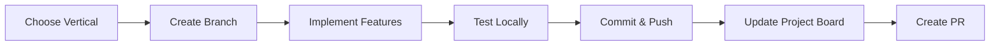

# Tomlinson Meal App - Phase 2 Development

## 🚀 Quick Navigation

**New here?** Start with [AGENT_QUICKSTART.md](./AGENT_QUICKSTART.md)

**Ready to work?** Check [PROJECT_BOARD.md](./PROJECT_BOARD.md) to claim a vertical

**Need details?** Read [DEVELOPMENT_VERTICALS.md](./DEVELOPMENT_VERTICALS.md)

**Want an example?** See [EXAMPLE_VERTICAL_2_WALKTHROUGH.md](./EXAMPLE_VERTICAL_2_WALKTHROUGH.md)

---

## 📊 Current Status

**Version:** 0.1.0 (MVP Complete)

**Phase 1 Features:** ✅ All 7 views enabled + Search functionality

**Phase 2 Features:** 🟢 Ready to start

---

## 🎯 Available Verticals for Agents

Pick one and get started!

| # | Vertical | Complexity | Priority | Time | Status |
|---|----------|-----------|----------|------|--------|
| 1 | **Health Analytics** | Medium | High | 3-5 days | 🟢 Available |
| 2 | **Grocery Enhancements** | Low | High | 2-3 days | 🟢 Available |
| 3 | **Recipe Intelligence** | Medium | Medium | 4-6 days | 🟢 Available |
| 4 | **User Profiles** | High | Medium | 5-7 days | 🟢 Available |
| 5 | **Meal Planning AI** | High | Low-Med | 7-10 days | 🟢 Available |

---

## 🎬 Getting Started (3 steps)

### 1. Choose Your Vertical
Read the comparison table above and pick based on:
- Your available time
- Complexity preference
- Priority for the project

### 2. Claim It
Update [PROJECT_BOARD.md](./PROJECT_BOARD.md) with your name and push

### 3. Start Building
```bash
git checkout -b feature/your-vertical
# Follow your vertical's spec in DEVELOPMENT_VERTICALS.md
```

---

## 📚 Document Guide

### [DEVELOPMENT_VERTICALS.md](./DEVELOPMENT_VERTICALS.md)
**Purpose:** Master specification document
**Use when:** You need complete details about a vertical
**Contains:**
- Full scope and features for each vertical
- Component architecture
- API contracts
- Integration points
- Dependencies and tasks

### [AGENT_QUICKSTART.md](./AGENT_QUICKSTART.md)
**Purpose:** Quick reference for agents
**Use when:** Starting work or need patterns
**Contains:**
- Vertical comparison table
- Quick start commands
- Common code patterns
- Troubleshooting tips
- Checklist before committing

### [PROJECT_BOARD.md](./PROJECT_BOARD.md)
**Purpose:** Project tracking and coordination
**Use when:** Claiming work or checking status
**Contains:**
- Progress visualization
- Vertical ownership
- Task checklists
- Integration timeline
- How to claim a vertical

### [EXAMPLE_VERTICAL_2_WALKTHROUGH.md](./EXAMPLE_VERTICAL_2_WALKTHROUGH.md)
**Purpose:** Detailed implementation example
**Use when:** You want a complete walkthrough
**Contains:**
- Step-by-step guide for Vertical 2
- Complete code examples
- Testing procedures
- Time estimates
- Best practices

---

## 🏗️ Architecture Overview

```
tomlinson-meal-app/
├── src/
│   ├── app/
│   │   ├── page.tsx              # Main app with tab routing
│   │   └── layout.tsx            # App layout
│   ├── components/
│   │   ├── views/                # Main view components (7 total)
│   │   ├── ui/                   # Radix UI primitives
│   │   └── [NEW: Add your vertical components here]
│   └── lib/
│       ├── types.ts              # TypeScript types
│       ├── loaders.ts            # Data loading functions
│       ├── sheets.ts             # CSV parsing utilities
│       ├── recipes.ts            # Recipe management
│       └── [NEW: Add your vertical utilities here]
├── DEVELOPMENT_VERTICALS.md      # Master spec
├── AGENT_QUICKSTART.md           # Quick reference
├── PROJECT_BOARD.md              # Project tracking
└── EXAMPLE_VERTICAL_2_WALKTHROUGH.md  # Implementation guide
```

---

## 🔄 Development Workflow



---

## ✅ Quality Standards

All verticals must meet:

- ✅ TypeScript strict mode (no errors)
- ✅ ESLint passing (no warnings)
- ✅ Mobile responsive (test 375px+)
- ✅ Loading states implemented
- ✅ Error handling added
- ✅ Accessibility (WCAG AA)
- ✅ API contracts documented

---

## 🤝 Coordination

### Avoiding Conflicts
- Each vertical has independent files
- Shared files (page.tsx, NavTabs.tsx) need coordination
- Use feature flags if needed
- Merge in priority order (see PROJECT_BOARD.md)

### Communication
- Update PROJECT_BOARD.md when claiming work
- Document assumptions in code
- Open issues for blockers
- Coordinate on shared file changes

---

## 📅 Timeline

**Week 1-2:** Parallel development (all agents work simultaneously)

**Week 3:** Integration (merge in priority order)

**Week 4:** Testing & polish

**Target:** Version 0.2.0 with all 5 verticals complete

---

## 🎯 Success Metrics

**Code:**
- 0 TypeScript errors
- 0 ESLint warnings
- 70%+ test coverage (target)

**Performance:**
- Lighthouse score 90+
- FCP < 1.5s
- TTI < 3s

**User Experience:**
- All features mobile responsive
- WCAG AA accessible
- Graceful error handling

---

## 💡 Tips for Agents

1. **Start simple** - Get basic functionality working first
2. **Test early** - Don't wait until the end
3. **Commit often** - Small, focused commits
4. **Follow patterns** - Use existing components as templates
5. **Ask questions** - Better to clarify than assume
6. **Document as you go** - Future you will thank you

---

## 🆘 Help & Support

**Stuck on TypeScript?** Check `src/lib/types.ts` for type definitions

**Component not rendering?** Verify imports and client/server boundaries

**Build failing?** Google Fonts issue is known - use `npx tsc --noEmit`

**Merge conflicts?** Coordinate with other agents on shared files

**General questions?** Check existing code patterns first

---

## 🚀 Let's Build!

The foundation is solid. The specs are clear. The path is mapped.

**Pick your vertical and start shipping! 🎉**

---

**Last Updated:** 2025-11-06
**Phase:** 2 (Feature Expansion)
**Status:** Ready for parallel development
